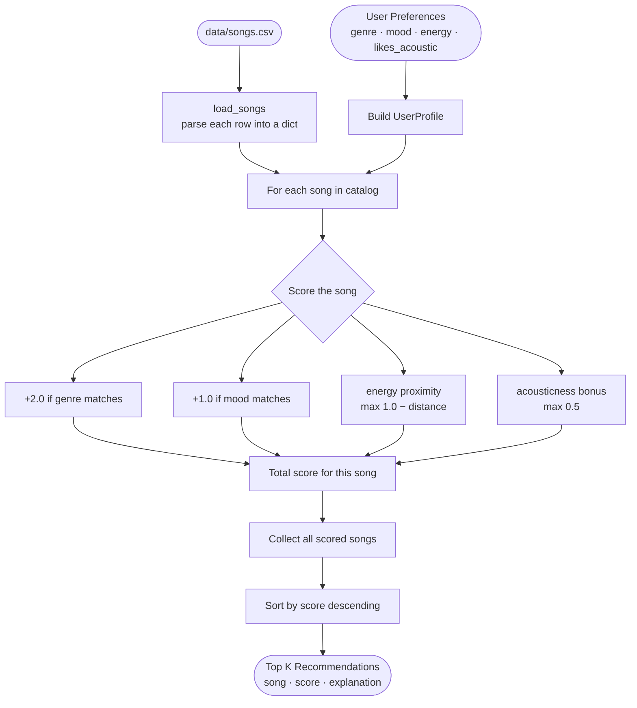
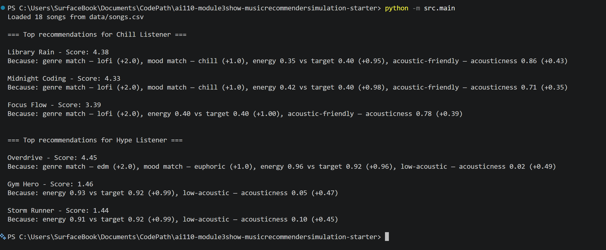

# 🎵 Music Recommender Simulation

## Project Summary

In this project you will build and explain a small music recommender system.

Your goal is to:

- Represent songs and a user "taste profile" as data
- Design a scoring rule that turns that data into recommendations
- Evaluate what your system gets right and wrong
- Reflect on how this mirrors real world AI recommenders

This code uses song attributes like genre, mood, energy, tempo, valence, danceability, and acousticness to compare each track to a user's favorite genre and mood. The recommender assigns higher scores to songs that match the user's preferred genre and mood, while also rewarding songs whose energy is close to the user's target energy and that align with an acoustic preference.

---

## How The System Works

This system is a simple content-based recommender. It focuses on song-level features rather than other users' behavior.

- Each `Song` uses these features:
  - `genre`
  - `mood`
  - `energy`
  - `tempo_bpm`
  - `valence`
  - `danceability`
  - `acousticness`
- Each `UserProfile` stores:
  - `favorite_genre`
  - `favorite_mood`
  - `target_energy`
  - `likes_acoustic`

### Algorithm Recipe

The `Recommender` scores each song against a `UserProfile` using four weighted rules:

| Rule | Condition | Points |
|---|---|---|
| Genre match | `song.genre == user.favorite_genre` | +2.0 |
| Mood match | `song.mood == user.favorite_mood` | +1.0 |
| Energy proximity | `max(0.0, 1.0 - abs(song.energy - user.target_energy))` | 0.0 – 1.0 |
| Acoustic fit | `acousticness * 0.5` or `(1 - acousticness) * 0.5` | 0.0 – 0.5 |

**Max possible score: 4.5**

Genre is weighted highest because it defines the broadest sonic category. Mood is secondary. Energy uses a proximity formula so songs that are "close but not exact" still earn partial credit rather than zero.

After scoring every song, the ranking rule sorts all scores descending and returns the top `k` results.

### Biases

- **Genre dominance:** Genre is worth +2.0 — double the mood weight. A song that perfectly matches the user's mood but is the wrong genre will consistently rank below an on-genre song with no mood match at all. Great cross-genre songs that match the user's vibe can get buried.
- **Catalog size:** With only 18 songs, a user whose preferred genre has only one or two songs in the catalog gets a thin shortlist, even if other tracks would suit them well.
- **Binary acoustic preference:** `likes_acoustic` is `True`/`False` with no gradient, so a user who "somewhat" likes acoustic tracks is treated identically to one who only wants pure acoustic recordings.
- **Ignored features:** `valence`, `danceability`, and `tempo_bpm` are stored on every song but not used in scoring, meaning two songs with identical genre/mood/energy can score the same even if one feels twice as danceable.

In a real product, systems combine this content-based signal with collaborative filtering — learning from what similar listeners liked or skipped — to reduce these blind spots.

---



## Getting Started

### Setup

1. Create a virtual environment (optional but recommended):

   ```bash
   python -m venv .venv
   source .venv/bin/activate      # Mac or Linux
   .venv\Scripts\activate         # Windows

2. Install dependencies

```bash
pip install -r requirements.txt
```

3. Run the app:

```bash
python -m src.main
```

### Running Tests

Run the starter tests with:

```bash
pytest
```

You can add more tests in `tests/test_recommender.py`.

---

## Code Output


## Experiments You Tried

**Experiment 1 — Weight shift: genre halved, energy doubled**

Changed genre weight from +2.0 to +1.0 and doubled the energy proximity score (multiplied by 2.0, giving a range of 0–2). Expected the rankings to shift noticeably toward energy-matching songs. Result: top-3 rankings were completely unchanged for all three tested profiles (Chill Lofi, High-Energy Pop, Deep Intense Rock). Conclusion: when a genre match exists in the catalog, categorical points (genre + mood) dominate the score regardless of how energy is weighted. Numeric weight tuning only matters when the user's genre is absent from the catalog.

**Experiment 2 — Adversarial profile: high energy + sad mood**

Tested a user profile with `energy: 0.90` (hype) and `mood: "sad"` (low-energy emotion) to see how the system handles conflicting preferences. Result: Heartbreak Hotel ranked #1 with score 3.73, despite its energy being 0.44 — far from the 0.90 target. The genre + mood match (3.0 pts combined) so heavily outweighed the energy penalty (−0.46 pts) that the system ignored the energy conflict. The system chose the emotionally correct song for the wrong reason — it wasn't balancing the conflict, it simply couldn't see past the categorical lock-in.

**Experiment 3 — Neutral profile (no genre, no mood)**

Tested a profile with empty genre and mood strings, energy=0.50, `likes_acoustic: False`. All 18 songs scored between 1.09 and 1.23 — a 0.14-point range across the entire catalog. The rankings were essentially arbitrary, decided by tiny differences in energy proximity and acousticness. This exposed that genre and mood are doing almost all the meaningful differentiation work; without them, the system has no useful signal.

---

## Limitations and Risks

- **Tiny catalog:** With only 18 songs, most genres have one or two entries. Users of underrepresented genres get one good result and four weak fallbacks.
- **No listening history:** The system cannot learn from skips, replays, or thumbs-up. Every session starts from zero — the same user always gets the same results regardless of how their taste evolves.
- **Genre labels are flat:** "intense" means something different in rock vs. EDM, but the system awards the same mood point either way. It has no concept of sub-genre compatibility.
- **Three collected features go unused:** `valence`, `danceability`, and `tempo_bpm` are stored on every song but never scored, meaning two songs can tie identically even when they sound very different.
- **Binary acoustic preference:** `likes_acoustic` is True/False with no gradient — "somewhat acoustic" is not expressible.

See [model_card.md](model_card.md) for a deeper analysis of bias and limitations.

---

## Reflection

Building this recommender made the invisible math behind streaming apps visible. Before this project, a Spotify recommendation felt like magic. After implementing even a simplified version, it's clear the magic is just arithmetic: weighted rules, sorted lists, and assumptions baked into which numbers count more than others.

The biggest surprise was how much genre dominates. I assumed energy — the most immediate quality you feel when a song plays — would drive the rankings. But halving the genre weight and doubling the energy weight didn't change a single top-3 result. Genre was silently running the show the entire time, and the outputs "looked right" so I hadn't noticed. That gap between a system that appears to work and one you actually understand is the most important thing I took from this project.

On bias: the neutral profile test was the clearest demonstration of how recommendation systems can produce confident-looking output that is essentially noise. All 18 songs scored within a 0.14-point range, yet the formatted list of song titles still looked like a real recommendation. A real user would never see the scores — they'd just assume the app "knew." That made me think differently about every recommendation I've ever received from a real app: the confidence of the presentation tells you nothing about the quality of the signal underneath.


